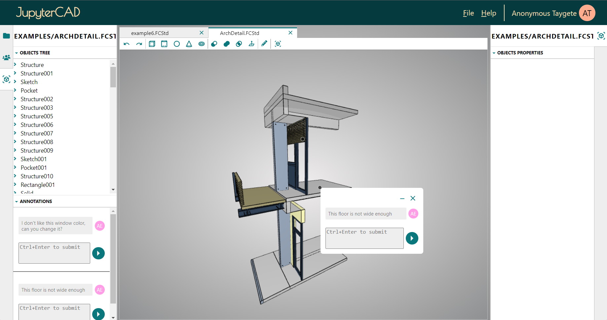

# JupyterCAD - A JupyterLab extension for 3D geometry modeling.

JupyterCAD is a JupyterLab extension for 3D geometry modeling with collaborative editing support. It is designed to allow multiple people to work on the same file at the same time, and to facilitate discussion and collaboration around the 3D shapes being created.

JupyterCAD has support for FreeCAD files, which makes it easy to import and export models from FreeCAD. It also has a range of features for creating and manipulating 3D shapes, including a variety of primitives, transformations, and Boolean operations.



## Requirements

- JupyterLab >= 4.0.0
- freecad (optional)

## Installation

You can install JupyterCAD using pip:

```bash
pip install jupytercad
```

Once you have installed the extension, you should be able to open and edit `.fcstd` files in JupyterLab.

## Contributing

JupyterCAD is an open-source project, and contributions are always welcome. If you would like to contribute to JupyterCAD, please fork the repository and submit a pull request.

See [CONTRIBUTING](CONTRIBUTING.md) for dev installation instructions.

## License

JupyterCAD is licensed under the BSD 3-Clause License. See the LICENSE file for more information.
