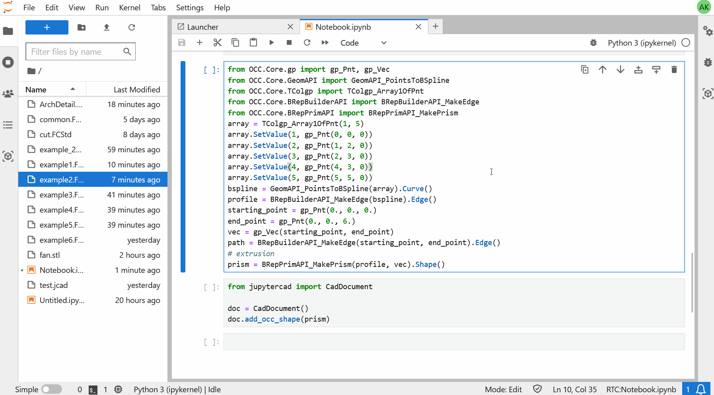

.. _python_api:

==========
Python API
==========

Basic Usage
===========

JupyterCAD provides a Python API that can be used for opening CAD documents,
create and edit primitives (cones, boxes, spheres etc.) and apply boolean
operations on them (cut, union, intersection etc.).

You can open an existing file and **display it in your Jupyter Notebook**:

.. code-block:: Python

    from jupytercad import CadDocument

    doc = CadDocument('file.FCstd')

    doc

**Opening an existing file would connect to the collaborative session of the file**,
meaning that anyone working on the same file from either the dedicated CAD app of the JupyterLab
extension would see the edit you perform from the Python API.

Creating a ``CadDocument`` object without providing a path to an existing file would create a
new empty document:

.. code-block:: Python

    from jupytercad import CadDocument

    doc = CadDocument()

    doc

Once the document is opened/created, you can start creating primitives and apply boolean operations.
The ``CadDocument`` does **method chaining**, allowing you to perform multiple operations in one line:

.. code-block:: Python

    from jupytercad import CadDocument

    doc = CadDocument()

    # Create a box, create a sphere, then cut the box using the sphere as a tool
    doc.add_box().add_sphere().cut()

    doc

You can also make use of the OpenCascade Python API using the ``pythonocc-core`` package:

.. code-block:: Python

    from jupytercad import CadDocument
    ...
    # Create a prism shape with OpenCascade
    prism = BRepPrimAPI_MakePrism(profile, vec).Shape()
    doc = CadDocument()
    doc.add_occ_shape(prism)
    display(doc)

``CadDocument`` API Reference
=============================

.. autoclass:: jupytercad.CadDocument
    :members:
